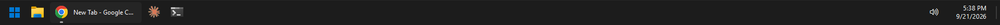

# MultiTaskbar - a full taskbar on every monitor for Windows 11

Free and open source. A complete taskbar on your second and third monitor: pinned apps, window
titles, volume, clock and show desktop.

Windows 11 gives secondary monitors a stripped-down taskbar: no system tray, no volume icon, and
pinned apps only if you also let every monitor show every open window. MultiTaskbar replaces those
secondary taskbars with a complete one:



- **Start button** and your **pinned apps**, in the same order as your main taskbar
- **Only the windows on that monitor**, so a window never shows up on every bar
- **Window titles**, following Windows' "Combine taskbar buttons and hide labels" setting
  (icons only when set to *Always*)
- **Volume**: click for a slider, scroll to change, middle-click to mute
- **Clock and date**, and **Show desktop** in the far-right corner
- Light and dark theme and your accent color, picked up from Windows
- Hides itself when an app goes full screen

Your main monitor's taskbar is not touched. When MultiTaskbar exits, the original Windows
taskbars on the other monitors come back.

## Install

1. Download `MultiTaskbar.exe` from the [latest release](../../releases/latest).
2. Put it in a folder where it can stay, for example `%LOCALAPPDATA%\Programs\MultiTaskbar`.
3. Run it. It asks once whether to start automatically when you sign in.

To change that later, right-click an empty spot on a MultiTaskbar bar and toggle
**Start with Windows**. If you move the exe, run it once from the new place and the startup
entry follows it.

Windows SmartScreen may warn about the download because the exe is not code-signed. Choose
**More info → Run anyway**, or build it yourself (below).

## Use

| Action | Result |
| --- | --- |
| Click an app | Switch to it, minimize it, or cycle through its windows |
| Shift+click or middle-click an app | Open a new window |
| Right-click an app | Window list, new window, close |
| Right-click an empty spot | Task Manager, Start with Windows, Exit |
| Click the clock | Date & time settings |

To quit, right-click an empty spot on the bar and choose **Exit MultiTaskbar**.

## Build from source

No Visual Studio or .NET SDK needed. It uses the C# compiler that comes with Windows:

```cmd
build.cmd
```

The result is `bin\MultiTaskbar.exe`. The whole app is a single file, `src\MultiTaskbar.cs`.

## Requirements

Windows 10 or 11, 64-bit, with more than one monitor. .NET Framework 4.x is part of Windows.

## Questions

**Why doesn't Windows 11 do this?** Its secondary taskbars are a separate, reduced version of the
real one. The system tray, the clock's calendar flyout and the volume flyout live only on the main
taskbar, and the pinned-apps setting is all-or-nothing.

**Does it replace my main taskbar?** No. The main monitor is untouched. MultiTaskbar hides the
stripped-down Windows taskbars on the other monitors while it runs and brings them back when it
exits.

**How is it different from DisplayFusion or Actual Multiple Monitors?** Those are paid,
feature-rich suites that also add multi-monitor taskbars. MultiTaskbar does one thing, is free,
open source, and is a single 46 KB exe with no installer, background service or telemetry.

**Does it work on Windows 10?** Yes, though Windows 10's own multi-monitor taskbar is already
closer to complete, so there is less to gain.

**Can I change the order of the pinned apps?** Pin and unpin on your main taskbar as usual;
MultiTaskbar follows it within a few seconds.

## Uninstall

Right-click the bar, turn off **Start with Windows**, choose **Exit MultiTaskbar**, then delete
the exe. Optional leftovers: the registry key `HKCU\Software\MultiTaskbar` and the log folder
`%LOCALAPPDATA%\MultiTaskbar`.

## License

[MIT](LICENSE)
